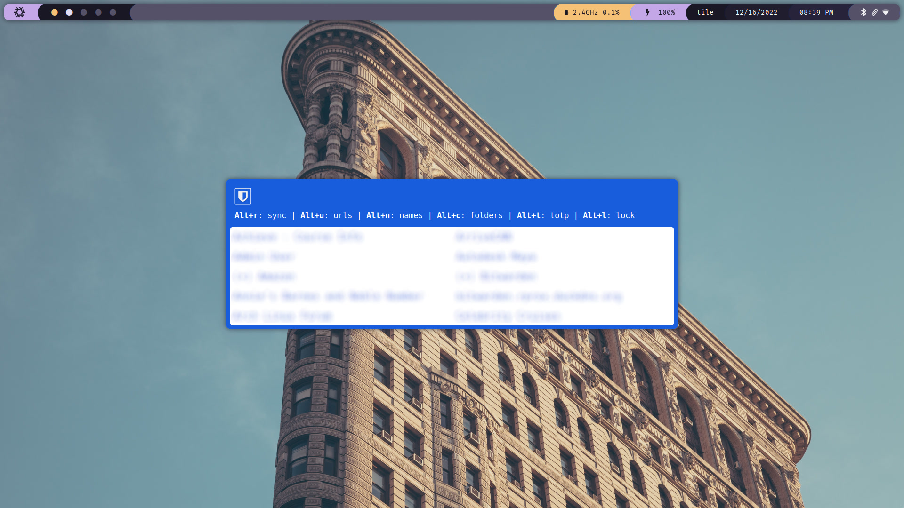
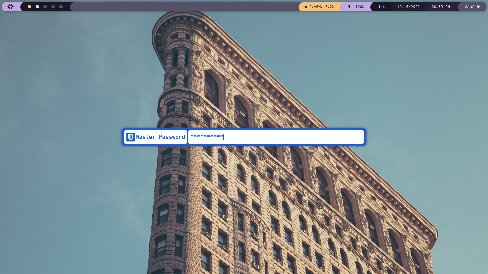

# Bitwarden Rofi Menu

This is a work in progress to get the BitWarden cli functionality in an easy
Rofi menu. On selecting an entry, the password is copied to your clipboard for
5 seconds. During those 5 seconds, a notification is shown indicating which
password you are copying at that time.

## WARNING

Rofi is _not_ meant for secure password handling. The password
entered into rofi in plaintext and exists in memory in that format in the stack
until it is piped into the bitwarden cli. Use at your own risk.




## Usage

You can either execute the script from a terminal or by binding it to a key
combination in your window manager.

```txt
bwmenu 0.4

Usage:
  bwmenu [options] -- [rofi options]

Options:
  --help
      Show this help text and exit.

  --version
      Show version information and exit.

  --auto-lock <SECONDS>
      Automatically lock the Vault <SECONDS> seconds after last unlock.
      Use 0 to lock immediatly.
      Use -1 to disable.
      Default: 900 (15 minutes)

  -c <SECONDS>, --clear <SECONDS>, --clear=<SECONDS>
      Clear password from clipboard after this many seconds.
      Defaults: 5 seconds.

  -C, --no-clear
      Don't automatically clear the password from the clipboard. This disables
      the default --clear option.

  --show-password
      Show the first 4 characters of the copied password in the notification.

  -p, --password-rofi-option
      Option pass to rofi '-theme-str' when asking for master password
      (Can be called multiple times).

Quick Actions:
  When hovering over an item in the rofi menu, you can make use of Quick Actions.

  Alt+r  Resync your vault

  Alt+u  Search through urls
  Alt+n  Search through names
  Alt+c  Search through folders

  Alt+t  Copy the TOTP
  Alt+1  Autotype the username and password [needs xdotool (Xorg) / ydotool (Wayland)]
  Alt+2  Autotype the username [needs xdotool (Xorg) / ydotool (Wayland)]
  Alt+3  Autotype the password [needs xdotool (Xorg) / ydotool (Wayland)]

  Alt+L  Lock your vault

Examples:
  # Default options work well
  bwmenu

  # Immediatly lock the Vault after use
  bwmenu --auto-lock 0

  # Never lock the Vault
  bwmenu --auto-lock -1

  # Only show rofi inputbar when asking for master password
  bwmenu -p "mainbox{children: [inputbar];}" \
    -p " inputbar{spacing: 20px;children: [prompt,entry];}" \
    -p window{height:inherit\;}

  # Place rofi on top of screen, like a Quake console
  bwmenu -- -location 2
```

### Functions

- <kbd>Alt</kbd>+<kbd>r</kbd>: Resync Bitwarden
- <kbd>Alt</kbd>+<kbd>u</kbd>: Search on url
- <kbd>Alt</kbd>+<kbd>n</kbd>: Search on names
- <kbd>Alt</kbd>+<kbd>c</kbd>: Select folder to search in
- <kbd>Alt</kbd>+<kbd>t</kbd>: Copy the TOTP
- <kbd>Alt</kbd>+<kbd>L</kbd>: Lock and exit

### Auto Typing

You can use bitwarden-rofi to auto type your _username_, _password_ or _both_ by
using xdotool/ydotool to autofill forms.

- <kbd>Alt</kbd>+<kbd>1</kbd>: Type username and password
- <kbd>Alt</kbd>+<kbd>2</kbd>: Type only the username
- <kbd>Alt</kbd>+<kbd>3</kbd>: Type only the password

> **Wayland Users**: For autotyping to work in Wayland, you will need
> [`ydotool`](https://github.com/ReimuNotMoe/ydotool) working with root
> permissions (it needs access to /dev/uinput) without asking for password. For
> example, this can be achieved by adding this line in `visudo`:

`your_username ALL=(ALL) NOPASSWD: /usr/bin/ydotool`

## Install

### With home-manager/nix

Add this flake to your flake inputs:

```nix
{
    inputs.bitwarden-rofi.url = github:the-argus/bitwarden-rofi;
}
```

Here's one installation example: a home-manager module.

```nix
{pkgs, bitwarden-rofi, ...}:
{
    home.packages = [
        bitwarden-rofi.packages.${pkgs.system}.default
    ];
}
```

### Via source

Install these **required** dependencies:

- rofi
- bitwarden-cli
- jq
- gnupg

Additionally, type `keyctl` into your terminal. If the command is not found,
that means the kernel keyring utilities are not installed on your system. Find
the package the provides this command and installed it- it's usually called
keyutils.

**Optionally** install these requirements:

- xclip, xsel, or wl-clipboard
- xdotool or ydotool (for autotype)

Then:

```bash
git clone https://github.com/the-argus/bitwarden-rofi
mkdir -p ~/.config
mv bitwarden-rofi ~/.config/bwmenu

sudo ln -s ~/.config/bwmenu/bwmenu /bin/bwmenu
```
